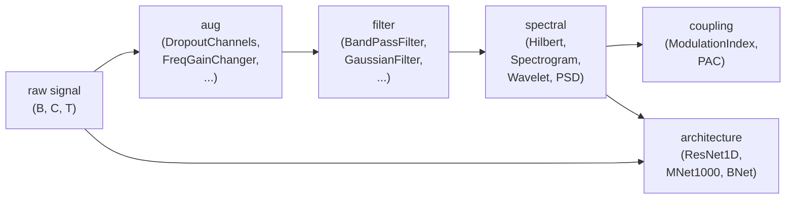
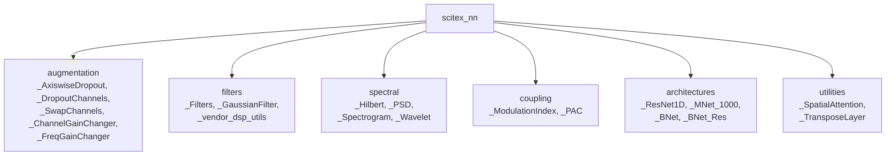

# SciTeX NN (<code>scitex-nn</code>)

<p align="center">
  <a href="https://scitex.ai">
    
  </a>
</p>

<p align="center"><b>PyTorch neural-network building blocks for signal processing — BNet, Hilbert, PAC, Wavelet, Filters, AxiswiseDropout, and more.</b></p>

<p align="center">
  <a href="https://scitex-nn.readthedocs.io/">Full Documentation</a> · <code>uv pip install scitex-nn[all]</code>
</p>

<!-- scitex-badges:start -->
<p align="center">
  <a href="https://pypi.org/project/scitex-nn/"></a>
  <a href="https://pypi.org/project/scitex-nn/"></a>
  <a href="https://scitex-nn.readthedocs.io/"></a>
  <a href="https://github.com/ywatanabe1989/scitex-nn/actions/workflows/rtd-sphinx-build-on-ubuntu-latest.yml"></a>
</p>
<p align="center">
  <a href="https://github.com/ywatanabe1989/scitex-nn/actions/workflows/pr-ci.yml"></a>
  <a href="https://codecov.io/gh/ywatanabe1989/scitex-nn"></a>
</p>
<!-- scitex-badges:end -->

---

## Problem and Solution

| # | Problem | Solution |
|---|---------|----------|
| 1 | Signal-processing layers (Hilbert, PAC, Wavelet, bandpass filters) are **scattered** across research codebases | **Drop-in** PyTorch modules — differentiable, batched, composable into any `nn.Module` |
| 2 | Standard `nn.Dropout` is **element-wise only** — no axis-wise option for channel/feature drop | `AxiswiseDropout` / `DropoutChannels` zero out **entire features** along a chosen axis |
| 3 | Custom blocks (BNet, MNet, ResNet1D) must be **re-implemented** for every project | Vetted reference implementations with **consistent APIs** and shape conventions |

## Demo

The shortest end-to-end demo: differentiable Hilbert envelope on a
multi-channel signal, axis-wise dropout for SSL pre-training.

```python
import torch
import scitex_nn

x = torch.randn(8, 19, 1024)              # (batch, channels, samples)

env = scitex_nn.Hilbert(seq_len=1024)(x)  # analytic signal: (..., 2)
phase, amplitude = env[..., 0], env[..., 1]

drop = scitex_nn.AxiswiseDropout(dropout_prob=0.5, dim=1).train()
y = drop(x)                               # whole channels zeroed
```



<p align="center"><sub><b>Figure 1.</b> Signal flow through scitex-nn: raw multi-channel tensors pass augmentation, filtering, and spectral stages before coupling analysis or classification architectures.</sub></p>

For tutorial-style runnable examples covering every public class,
see the [Gallery](#gallery) below — each is a self-contained
`examples/<NN>_*.ipynb` whose cell outputs render inline on GitHub.
`examples/00_run_all.sh` re-executes every notebook in place.

## Installation

```bash
uv pip install "scitex-nn[all]"
```

Requires Python >= 3.9.

<details>
<summary><b>Per-module extras</b></summary>

<br>

| Extra | Pulls in |
|---|---|
| `all` | `dev` + `docs` (recommended) |
| `dev` | pytest, ruff, joblib, flask, ipdb + scitex-dev (contributors) |
| `docs` | Sphinx + RTD theme + myst-parser (docs build only) |

```bash
uv pip install -e ".[dev]"   # editable install for contributors
```

</details>

## Architecture

`scitex-nn` is a flat collection of `nn.Module`s grouped by what they do
to a `(batch, channels, samples)` tensor:



<p align="center"><sub><b>Figure 2.</b> Module groups in scitex-nn. Every group operates on ordinary torch tensors, so layers compose as plain <code>nn.Sequential</code>: signal-processing layers on the last (time) axis, channel-aware augmentations on <code>dim=1</code>.</sub></p>

## 2 Interfaces

<details open>
<summary><strong>Python API</strong></summary>

<br>

```python
import scitex_nn as nn

# Differentiable Hilbert transform
hilbert = nn.Hilbert(seq_len=512, dim=-1)

# Bandpass filter bank
filt = nn.Filters(...)

# Axis-wise dropout (drop entire channels/features)
drop = nn.AxiswiseDropout(dropout_prob=0.5, dim=1)

# Phase-amplitude coupling
pac = nn.PAC(...)

# Reference architectures
model = nn.BNet(...)
```

> **[Full API reference](https://scitex-nn.readthedocs.io/en/latest/api/scitex_nn.html)**

</details>

## Gallery

Each notebook is self-contained — clone, open, run cell-by-cell. Cell
outputs are baked in (`jupyter nbconvert --execute --inplace`) so
every figure renders inline on GitHub. Ordered simple → complex.

| # | Notebook | Topic |
|---|---|---|
| 01 | [`examples/01_axiswise_dropout.ipynb`](examples/01_axiswise_dropout.ipynb) | `AxiswiseDropout` — drop entire slices along an axis |
| 02 | [`examples/02_channel_aug.ipynb`](examples/02_channel_aug.ipynb) | `DropoutChannels` / `SwapChannels` / `ChannelGainChanger` |
| 03 | [`examples/03_gaussian_filter.ipynb`](examples/03_gaussian_filter.ipynb) | `GaussianFilter` — temporal smoothing at three sigmas |
| 04 | [`examples/04_filter_bank.ipynb`](examples/04_filter_bank.ipynb) | `LowPass` / `HighPass` / `BandPass` / `BandStop` frequency response |
| 05 | [`examples/05_psd.ipynb`](examples/05_psd.ipynb) | `PSD` vs `scipy.signal.welch` on sine, two-tone, 1/f noise |
| 06 | [`examples/06_freq_gain_changer.ipynb`](examples/06_freq_gain_changer.ipynb) | `FreqGainChanger` — softmax-weighted random per-band gain |
| 07 | [`examples/07_hilbert.ipynb`](examples/07_hilbert.ipynb) | `Hilbert` vs `scipy.signal.hilbert` on a chirp + AM signal |
| 08 | [`examples/08_spectrogram.ipynb`](examples/08_spectrogram.ipynb) | `Spectrogram` STFT magnitude on a 5→60 Hz chirp |
| 09 | [`examples/09_wavelet.ipynb`](examples/09_wavelet.ipynb) | `Wavelet` Morlet CWT — adaptive time-frequency resolution |
| 10 | [`examples/10_modulation_index.ipynb`](examples/10_modulation_index.ipynb) | `ModulationIndex` (Tort 2010) on coupled vs uncoupled theta-gamma |
| 11 | [`examples/11_pac.ipynb`](examples/11_pac.ipynb) | `PAC` end-to-end comodulogram on synthetic theta-gamma |
| 12 | [`examples/12_differentiable_bandpass.ipynb`](examples/12_differentiable_bandpass.ipynb) | `DifferentiableBandPassFilter` — learnable band centres |
| 13 | [`examples/13_spatial_attention.ipynb`](examples/13_spatial_attention.ipynb) | `SpatialAttention` — per-channel gain from a 1×1 conv |
| 14 | [`examples/14_resnet1d.ipynb`](examples/14_resnet1d.ipynb) | `ResNet1D` — tiny train loop on synthetic 1D data |
| 15 | [`examples/15_mnet1000.ipynb`](examples/15_mnet1000.ipynb) | `MNet1000` forward + backward + per-parameter gradient norms |
| 16 | [`examples/16_bnet.ipynb`](examples/16_bnet.ipynb) | `BNet_v1` 2-modality forward + per-submodule parameter distribution |

<p align="center"><sub><b>Table 1.</b> Gallery notebooks, ordered simple to complex. Every notebook is self-contained with baked-in cell outputs.</sub></p>

<details>
<summary><strong>Skills — for AI Agent Discovery</strong></summary>

<br>

Skills provide workflow-oriented guides that AI agents query to discover capabilities and usage patterns.

```bash
scitex-dev skills export --package scitex-nn  # Export to Claude Code
```

</details>

## Available Modules

| Category | Modules |
|----------|---------|
| **Signal transforms** | `Hilbert`, `Wavelet`, `Spectrogram`, `PSD`, `Filters`, `GaussianFilter` |
| **Coupling / features** | `PAC`, `ModulationIndex` |
| **Dropout variants** | `AxiswiseDropout`, `DropoutChannels` |
| **Augmentation** | `ChannelGainChanger`, `FreqGainChanger`, `SwapChannels` |
| **Architectures** | `BNet`, `BNet_Res`, `MNet_1000`, `ResNet1D` |
| **Utilities** | `SpatialAttention`, `TransposeLayer` |

<p align="center"><sub><b>Table 2.</b> Public modules by category. See the Gallery notebooks for runnable examples of each.</sub></p>

## Part of SciTeX

`scitex-nn` is part of [**SciTeX**](https://scitex.ai). Install via the
umbrella with `pip install scitex[nn]` to use as `scitex.nn` (Python).

```python
import scitex
import scitex_nn as nn

@scitex.session
def main(CONFIG=scitex.INJECTED):
    signal = scitex.io.load("signal.npy")
    hilbert = nn.Hilbert(seq_len=signal.shape[-1], dim=-1)
    out = hilbert(signal)
    scitex.io.save(out, "analytic.npy")
    return 0
```

The SciTeX system follows the Four Freedoms for Research below, inspired by [the Free Software Definition](https://www.gnu.org/philosophy/free-sw.en.html):

>Four Freedoms for Research
>
>0. The freedom to **run** your research anywhere — your machine, your terms.
>1. The freedom to **study** how every step works — from raw data to final manuscript.
>2. The freedom to **redistribute** your workflows, not just your papers.
>3. The freedom to **modify** any module and share improvements with the community.
>
>AGPL-3.0 — because we believe research infrastructure deserves the same freedoms as the software it runs on.

---

<p align="center">
  <a href="https://scitex.ai" target="_blank"></a>
</p>

<!-- EOF -->
